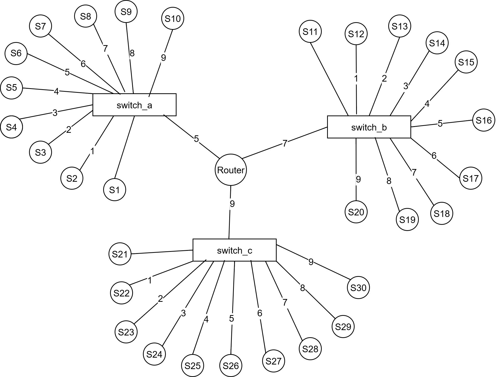

# Serf Hilbert Range Query with Pruning

## Overview

This repository contains an experimental implementation of a latency‑aware range query system built on top of **Serf Vivaldi network coordinates** and a **Hilbert‑curve–based multidimensional index (Lawder DB)**. The goal of the experiment is to efficiently answer queries of the form:

> *Given a query node and an RTT threshold T, which nodes are expected to be within T milliseconds?*

Instead of checking every node individually, the system uses **geometric pruning over indexed coordinate space** to avoid exploring regions that cannot contain valid answers. This significantly reduces unnecessary work while preserving correctness.

The experiment is evaluated on a **30‑node topology** deployed using Containerlab, with Serf providing predicted RTT coordinates and Lawder’s Hilbert indexing providing fast multidimensional range access.

The core logic lives in the custom driver `serf_driver`, which integrates Serf data with the Lawder index and applies a multi‑stage pruning strategy during query execution.

---

## High‑Level Idea

At a high level, the system works as follows:

1. Each node has a predicted network coordinate derived from Serf’s Vivaldi algorithm.
2. These coordinates are mapped into a fixed‑dimensional space and indexed using a Hilbert curve.
3. A range query is issued as a geometric region corresponding to an RTT threshold.
4. During traversal of the index, entire regions are skipped if they cannot possibly contain valid nodes.
5. Only nodes that pass all pruning checks are returned as candidates.

The result is a fast, scalable approximation of RTT‑based neighbor discovery.

---

## Repository Structure

```
.
├── clab-nebula/           # Containerlab topology files for the 30-node setup
├── cluster-status/        # Serf cluster status snapshots
├── coordinates_rtts/      # Scripts for collecting coordinate data 
├── images/                # 30 node topology image
├── lawder/                # Lawder source code
│   └── 00make/            # Build directory (driver must be run from here)
│   └── hilbert/           # Maps multidimensional coordinates to a one-dimensional Hilbert index
│   └── btree/             # Logical index structure that orders Hilbert values and supports efficient range traversal
│   └── db/                # Low-level storage layer that handles disk pages, buffering, and persistence
│   └── tests/             # Contains driver programs, including the custom serf_driver used in this experiment
│   └── utils/             # Shared helper functionality used across Lawder components
├── results/               # The analysis and results
├── router/                # Router configuration for the topology
├── rtt-matrix/            # Ground-truth and predicted RTT matrices
├── scripts/               # Helper scripts for topology execution (eg: injecting delays, cleaning up, etc.)
├── serf_binaries/         # Includes 5D Serf executable used in this experiment
├── 30nodes.yml            # Containerlab topology definition
├── Dockerfile             # Container image for reproducible builds
└── ip-mapping.txt         # File used to configure Node IPs. This is used as a bind in the topology definition file.
```

---

## Experimental Setup

### Topology

* 30 Serf nodes
* Nodes are connected via three switches and a central router
* Network delays are injected to create controlled RTT patterns



### Coordinates

* Serf uses Vivaldi to compute predicted RTT coordinates
* Each node is represented as a fixed‑dimensional vector
* These vectors form the input dataset for the index

### Indexing

* Coordinates are indexed using a Hilbert curve
* The index is built once per Hilbert order
* Queries reuse the index unless explicitly rebuilt

---

## Building the Driver

The `serf_driver` executable is built inside the Lawder build directory:

```
lawder/00make
```

Typical build process:

1. Enter the build directory
2. Run `make -f linux.m serf_driver.exe`
3. Ensure `serf_driver.exe` is produced

The driver **must be executed from this directory**, as it relies on relative paths for index files and inputs.

Note: Since this repository already contains the compiled `serf_driver.exe` inside `lawder/00make` it can be directly execued without building.

---

## Running the Driver

Basic query execution:

```
./serf_driver.exe --qnode clab-nebula-serf1 --rtt 15 --horder 10
```

Rebuilding the index:

```
./serf_driver.exe --qnode clab-nebula-serf1 --rtt 15 --horder 10 --rebuild
```

### When to Use `--rebuild`

The `--rebuild` flag forces regeneration of the Hilbert index and underlying database files. It is required when:

* The coordinate input file has changed
* The Hilbert order is changed
* The dataset itself is modified

If none of the above has changed, the flag can be omitted and the existing database will be reused.

---

## Command‑Line Options

| Option      | Description                                                         |
| ----------- | -------------------------------------------------                   |
| `--qnode`   | Query node name (for example `clab-nebula-serf1`) |
| `--rtt`     | RTT threshold in milliseconds                     |
| `--horder`  | Hilbert curve order used for indexing             |
| `--rebuild` | Force rebuild of the index and database           |
| `--debug`   | Enable verbose debug output                       |
| `--json`    | Path to the Serf cluster status JSON file containing node coordinates and metadata. <br> If not specified, the default  file used in the code is applied. |
                

---

## How the Query Works

The key challenge addressed here is how to map an RTT-based query region into a form that can be efficiently processed by a Hilbert-curve index.

### Background Intuition

An RTT-based query naturally defines a *circular* search region around the query node. However, a Hilbert curve index operates over *axis-aligned sub-quadrants* of a fixed grid. The core task, therefore, is to approximate the circular query region using a carefully selected set of Hilbert sub-quadrants, while minimizing unnecessary coverage.

The approach can be explained clearly by breaking it into three conceptual steps.

### Step 1: Sub-Quadrant Size Definition

First, the system determines the size of the smallest grid cells used by the index. This is done by taking the maximum latency range observed in the cluster and dividing it by (2^k), where (k) is the order of the Hilbert curve.

This defines a uniform grid in which each sub-quadrant represents a fixed latency span. The choice of (2^k) ensures that the grid resolution matches the Hilbert index exactly.

### Step 2: Shifted Coordinate System

In this step, all node coordinates are mapped into a shifted coordinate system in which each dimension spans the range `[0, latency_max]`. The origin of this system corresponds to the leftmost and bottommost coordinate in the original Vivaldi space, ensuring that all coordinates are non-negative and indexable.

Each axis is uniformly partitioned into `2^k` equal sub-intervals, where `k` is the order of the Hilbert curve. As a result, the space is divided into sub-quadrants of size `latency_max / (2^k)` along each dimension. This grid resolution matches the Hilbert index exactly and defines the smallest spatial units used during query processing.

This shifted space is not the original Vivaldi coordinate system. Instead, it is a normalized space designed purely for indexing and querying.

### Step 3: Mapping the Query Region to Sub-Quadrants

The query node’s coordinates are first located within the shifted coordinate system. An RTT-based search region is then defined conceptually around this point.

The algorithm does not directly map the circular RTT region into a single bounding box for querying. Instead, it computes how many grid cells the RTT threshold spans along each dimension, based on the sub-quadrant size. This defines an initial axis-aligned search box centered at the query node.

This search box is recursively subdivided into smaller sub-quadrants. For each sub-quadrant, geometric intersection checks are applied to determine whether the sub-quadrant can possibly intersect the RTT sphere. Sub-quadrants that cannot intersect the RTT region are discarded early.

The remaining sub-quadrants represent the spatial regions that may contain valid results and are candidates for further evaluation.

---

## Pruning Strategy 

The pruning mechanism is based on a simple idea:

> If even the best‑case node inside a region cannot satisfy the RTT limit, then no real node inside that region can.

The lower bound used for pruning is constructed as follows:

* First, the algorithm computes the minimum possible coordinate distance between the query node and the sub-quadrant. This value depends only on the query node’s coordinates and the geometric bounds of the box, and is independent of the actual locations of nodes inside the box.

* Next, the algorithm scans the nodes contained in the sub-quadrant and extracts Height and Adjustment values that minimize the predicted RTT contribution. These values are selected independently and are not required to originate from the same real node.

* Finally, the query node’s own Height and Adjustment are combined with the minimum coordinate distance and the selected box-level values to form an optimistic lower bound on the RTT for the entire sub-quadrant.

If this optimistic lower bound already exceeds the RTT threshold, the entire sub-quadrant is pruned without querying the Hilbert index. Only sub-quadrants that pass this pruning step are subsequently queried through the Hilbert index using the Lawder implementation.

---

## Lawder Code

This repository includes the Lawder Hilbert DB implementation, which provides:

* Multidimensional indexing using Hilbert curves
* Efficient mapping between multidimensional regions and linear index ranges
* Tree‑based storage and traversal mechanisms

The Lawder code is used as an underlying indexing engine. It is not modified extensively, and its internal details are intentionally abstracted away. The focus of this repository is on how the driver *uses* the index, not on re‑implementing the index itself.

---

## Results and Evaluation

This repository supports multiple evaluation scenarios, including:

* Different RTT thresholds
* Different Hilbert orders
* Queries issued from each node

Results are analyzed using:

* True positives, false positives, and false negatives
* Precision, recall, and Jaccard similarity
* Ground‑truth RTT matrices for validation

Detailed analysis can be found in the results report [here](https://github.com/haarshdev/hilbert-range-query/blob/master/results/Range%20Query%20Results%20Small%20Topology.pdf)

---

## What to Expect from This Repository

* A clear example of integrating network coordinates with spatial indexing
* A practical demonstration of pruning‑based acceleration
* Reproducible experiments on a realistic multi‑node topology
* A foundation for further work on latency‑aware distributed queries

---

## Notes

* The driver assumes a fixed dataset size and coordinate dimensionality
* All paths are relative to the Lawder build directory
* This code is intended for experimental and research use

---

## References

[1] HashiCorp, “Serf network coordinates (Vivaldi),” HashiCorp Serf Documentation. [Online]. Available: https://github.com/hashicorp/serf/blob/master/docs/internals/coordinates.html.markdown

[2] J. K. Lawder and P. J. H. King, “Using space-filling curves for multi-dimensional indexing,” in Advances in Databases – Proceedings of the 17th British National Conference on Databases (BNCOD 17), B. Lings and K. Jeffery, Eds., Lecture Notes in Computer Science, vol. 1832. Berlin, Germany: Springer-Verlag, Jul. 2000, pp. 20–35. [Online]. Available: https://jlawder.github.io/Hilbert-Curve/publications/bncod17.pdf

[3] J. K. Lawder and P. J. H. King, “Querying multi-dimensional data indexed using the Hilbert space-filling curve,” ACM SIGMOD Record, vol. 30, no. 1, pp. 19–24, Mar. 2001. [Online]. Available: https://jlawder.github.io/Hilbert-Curve/publications/JL3_00.pdf

[4] J. K. Lawder, The MASH File: Demonstration Software for Space-Filling Curve Indexing, demonstration software, University of London, 2000. [Online]. Available: https://jlawder.github.io/Hilbert-Curve/software.html


These references provide the theoretical foundation for Hilbert-curve–based multidimensional indexing and the practical background for Serf’s network coordinate system used in this project.

## License
This project is provided for educational and research purposes. Container images and routing software are subject to their respective licenses.

## Author
Created by Harsha Nanayakkara as part of a large-scale research project, focusing on latency-aware range queries using Serf Vivaldi coordinates and Hilbert-curve–based indexing.